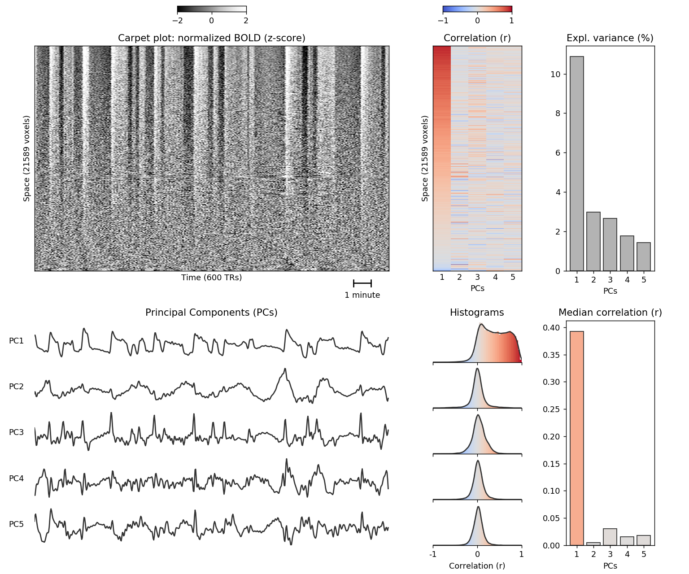

# pcarpet
[](https://travis-ci.org/niksirbi/pcarpet)


'pcarpet' is a small python package that creates a **carpet plot** from fMRI data and decomposes it with **PCA**.

**Author:** 

[Nikoloz Sirmpilatze](https://github.com/niksirbi) ([German Primate Center](https://www.dpz.eu/))

**Citation:** 

Sirmpilatze et al 2021 (preprint with doi coming soon)

## Rationale
A 'carpet plot' is a 2d representation of fMRI data (voxels x time), very similar to 'The Plot' described by Jonathan D Power ([Power 2017](https://www.sciencedirect.com/science/article/abs/pii/S1053811916303871?via%3Dihub)). 
This visual representation of fMRI data is suited for identifying wide-spread signal fluctutations 
([Aquino et al. 2020](https://www.sciencedirect.com/science/article/pii/S1053811920301014)), 
which often come from non-neural sources (e.g. head motion).

That said, the carpet plot can also reveal 'real' neural activity, especially when the activity is slow and synchronous, as is the case for **anesthesia-induced burst-suppression** (Sirmpiltze et al. 2021).
The `pcarpet` package implements the analytical pipeline used in the Sirmpiltze et al. 2021 paper to identify instances of burst-suppression in anesthetized humans, nonhuman primates, and rats.

The pipeline consists of the following steps:

1. First tha necessary data is imported, consisting of a preprocessed fMRI scan (4d NIFTI file) and a mask (3d NIFTI file) defining a single region-of-interest.
2. A carpet plot is generated from within the mask. To make wide-spread fluctuations more visually prominent, the voxel time-series (carpet rows) are normalized (z-score) and re-ordered according to their correlation with the mean time-series.
3. Principal Component Analysis (PCA) is applied to the carpet matrix (using the `scikit-learn` implementation) and a given number (`ncomp`, default is 5) of first Principal Components - hereafter referred to as 'fPCs' - is extracted. The fPCs (e.g. PC1 - PC5) represent the temporal patterns of activity with the highest explained variance ratios.
4. The fPCs are correlated with all voxel time-series within the carpet to get a distribution of Pearson's correlation coefficients (*r*) per fPC.
5. The fPCs are also correlated with the entire fMRI scan, including areas outside the mask, to get the brain-wide spatial distribution of each fPC.
6. A visual summary of results from steps 1-4 is plotted (example below).



The above image corresponds to an instance of burst-suppression in a female long-tailed macaque (*Macaca fascicularis*) anesthetized with isoflurane. The carpet plot (using a cortical mask) shows a wide-spread, slow, quasi-periodic signal fluctuation, which is well captured by PC1. PC1 is positively correlated with most cortical voxel timeseries, resulting in a heavily asymmetric distribution of correlation coefficients (*r*), while PCs 2-4 show symmetric *r* histograms centered on zero. This property can be quantified by taking the median of carpet-wide *r* values (bottom right). According to the terminology introduced in Sirmpilatze et al. 2021, PC1 is an 'asymmetric PC`. Under the right circumstances, the presence of an asymmetric PC in a cortical carpet plot can be an fMRI signature of burst-suppression, with the brain-wide distribution of the asymmetric PC representing a map of burst-suppression (see manuscript for details).

## Installation

### a. pip
You can install the latest release from PyPI via

```python
pip install pcarpet
```

Pip will try to ensure that the following requirements are satisfied:

1. Python 3.6 or higher
2. [numpy](https://numpy.org/)
3. [scipy](https://scipy.org/)
4. [matplotlib](https://matplotlib.org/)
5. [pandas](https://pandas.pydata.org/)
6. [scikit-learn](https://scikit-learn.org/stable/)
7. [nibabel](https://nipy.org/nibabel/)
8. [ipython](https://ipython.org/)

### b. Anaconda
If you are having issues with resolving package dependencies, you can create a virtual environment using [Anaconda](https://www.anaconda.com/products/individual):

1. Install an Anaconda distribution of python, choosing python 3.x and your operating system.
2. Download the `environment.yml` file from this repository. You can clone the repository or copy-paste the file contents into a text document on your local computer.
3. Open a terminal/anaconda prompt with conda for python 3 in the path.
4. Navigate to the directory where the `environment.yml` is stored and run `conda env create -f environment.yml`
5. Activate the environment with `conda activate pcarpet-env` (Note: you will always have to activate `pcarpet-env` before using `pcarpet`)


## Usage
Running `pcarpet` only requires 3 arguments (paths):

1. **fMRI file**: a 4d nifti file containing the preprocessed fMRI data
2. **Mask file**: a 3d nifti file, containing a binary mask that defines a region-of-interest (e.g. cortex)
3. **Output folder**: for storing the outputs generated by pcarpet

```python
import pcarpet

MyData = pcarpet.Dataset(fmri_file, mask_file, output_folder)
MyData.run_pcarpet()
```

Detailed instructions on running `pcarpet` are available as a [jupyter notebook](doc/example_usage.ipynb). The notebook runs `pcarpet` on some example data, either in a single step (as above), or by separately calling the various parts of the pipeline. The notebook also explains additional optional arguments and the standard set of `pcarpet` outputs.

## Acknowledgements
This project was created using the [shablona template](https://github.com/uwescience/shablona).

